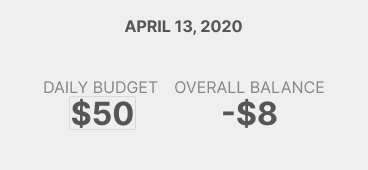
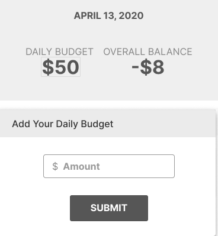

# Design Specification
## Problem
Ask any person if they feel like they have enough money, and there is a good chance the answer will be “no”, regardless of how much money they make. There are many ways to make more money, but that appears to be only part of the problem. Usually, when people suggest changing how you spend money, the first solution that comes to mind is budgeting; sit down, write out a tedious and detailed plan with categories your grandparents used and decide how much you want to allot to each one over a year or month. This approach is justified by giving the user a detailed look at the numbers, but “the trouble people have with budgeting isn’t about numbers, but about behavior.” The classical budgeting solution is front-loaded, abstract, antiquated, and unapproachable. We want to re-imagine the solution space to require minimal onboarding, to meet modern user needs, and to encourage users to achieve goals that feel attainable, immediate and concrete.

## Solution
We envision an entry form in which users can quickly and manually add transactions including the amount spent, date of transaction, and description. For the onboarding process, user will enter their daily budget goal into the goal text field. Each successive entry will be totaled. The “status” of the system(how much money you have left to spend) is the budget to date minus the total expenses entered. Successive days will roll over the budget status from the previous day, continuously accumulating leftover budget room or overages in the budget. As the form and representations will be text-oriented, the interface will aim to be straightforward and simplistic. The “status” visualization is what will prompt user behavior, and will be located at the top of the screen, followed right below by the entry form. Between viewing statuses and entering transactions, the design is all captured under one screen.

The interface is simple. Users will be prompted to login and provide their credentials.

Users will be able to see their daily budget, their transactions, and whether or not they are being consistent with their budgeting goals on the single screen.

On the top of the screen, users will have a brief summary of their expenses. "Daily Budget" refers to how much money they have spent out of how much they want to spend today. "Rollover" is a culmination of the user's expenses and compares it to their overall budget. It answers the question whether has the user been consistently meeting his or her goals every day, and by how much.

Users may adjust their daily budget goal by interacting with the text field.

A static form is located underneath the summary so that the user can manually enter his or her transactions. The form asks for the date, amount, and a description. After the text fields are completed and the submit button is pressed, the summary calculations take place and the form is cleared.

Underneath the form are the user's historical transactions. This card view places recent transactions on the top of the list and older ones on the bottom. Each card provides information that was manually inputted by the user and serves to document all expenses that lead to the overall summary.

The web app's interface layout is responsive to different screen sizes, but prioritize the mobile experience, where the entry form and status are viewable without scrolling on a standard mobile screen.

Below is a pseudo-code picture of the algorithm that calculates “status”

