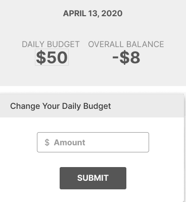
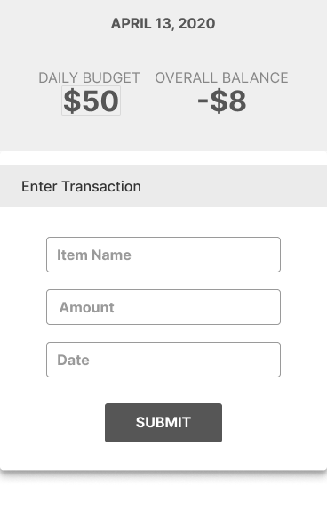
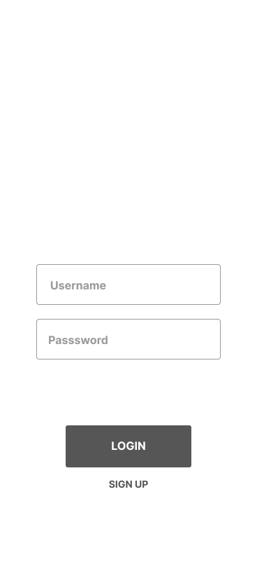
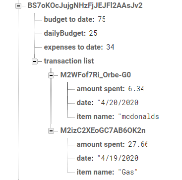

# Requirements Document

## Main Screen
1. The webpage is responsive and all transaction entry components will fit within the iPhone X standard size mobile screen (375x812px).

- **Verification:** Manually confirm all images and forms are readable by resizing the web application from desktop to mobile screens using inspect. We are confirming that all the elements of the components are approximately the  intended sizes.

2. The app will be divided into three sections: budget summary depicting ‘daily budget’ and the ‘overall balance’  from the user’s inputted transactions, an ‘entry form’, and a list of latest transactions. Each component is defined below.
- **Verification:** Visually confirm that the three components render within expectations of the requirements. This requirement doesn’t require intense testing, we will consider the requirement complete as long as each of the sections are in the correct order of: budget summary,  entry form, and latest transactions. 

3. A new user will see the three sections with a default  value of 0 for ‘daily budget’ and ‘overall balance’. The new user will see a ‘add your daily budget’ form to submit a first daily budget. This form only appears for new users.
- **Verification:** Verify that daily budget and overall balance initiate at 0. The “add your daily budget form” will only appear when the daily budget is at 0 for new users.

4. A returning user will see the three sections: Budget Summary, Add Your Daily Budget, and Enter Transaction. Once the user has submitted their first Daily Budget, they will be considered a Returning User. From then on, if the user would like to change their daily budget, they will have to click on their Daily Budget Amount in the Budget Summary, which will be a text box they can edit the amount in.
- **Verification:**  Visually confirm that the three components render for a new user. Returning users will no longer see the Add Your Daily Budget section and will have it replaced with a functioning text box that updates the budget.
5. The login page is not a part of our MVP requirement. Historical transaction data are stored in state (locally) for the ‘Latest Transaction’ section.
- **Verification:** Add a console.log(state) line in the Main render function. Manually add a transaction via running version of the app and confirm in the console that the printed state includes the newly added transaction.

**Figure 1: Budget Summary & Entry Transaction Form**

## Budget Summary (Figure 1)
6. The budget summary area will appear at the top of the screen.
- **Verification:** Visually confirm the summary section renders above the other two sections.

7. The ‘expenses to date’ value is initialized with zero.  Each time the user completes the  ‘entry form’ the amount spent from the form will be added to the ‘expenses to date’ value. 
- **Verification:** Add a console.log(expensesToDate) statement in the Main render function. Confirm it is first zero. Then add a transaction via the entry form and confirm in the console that expensesToDate increases by the amount entered in the transaction.

8. The user will be able to edit the value in the daily budget field, limited to positive and non-zero numbers. The program will save the user's field entry as ‘daily budget’.
- **Verification:** Add a console.log(dailyBudget) statement in the Main render function. Manually attempt to edit the daily budget field in a running version of the app. Manually enter negative and zero. Confirm that the above instances do not cause changes to the value in the console, and that positive and non-zero numbers do change the dailyBudget value by the amount entered.

9. The ‘budget to date’ value is initialized with the ‘daily budget’ value. At the start of each calendar day (determined by the timezone on the users’ local device) the program will add the ‘daily budget’ value to the ‘budget to date’. 
- **Verification:** Perform a code review to ensure that the operation uses a locally calculated ‘new Date()’ constructor to determine time of update.  Further confirm in the code review that the budgetToDate value will update as time incrementally with the value of the dailyBudget for each passing day.
10. That ‘running total’ will be subtracted from the ‘budget to date’. The program will display this value to the user and label it as ‘overall balance’ (the amount of money leftover from the budget of the previous days). 
- **Verification:**  Manually add a transaction in a running version of the app. Visually confirm that the value underneath ‘overall balance’ decreases by the amount of the transaction entered. Manually change the ‘dailyBudget’ value and visually confirm that the ‘overall balance’ changes by the same amount. 

## Entry Transaction Form (Figure 1)
11. The ‘entry form’ has two required text fields (labeled ‘amount spent’ and ‘item name’), and an optional date field (labeled date). 
- **Verification:** Visually confirm the required text fields are ‘amount spent’ and “item name”. Add a console.log(state) line in the Main render function. Conduct multiple attempts to submit the entry form in a running version of the app. Each attempt should test the required nature of each field and each combination(allows no date, requires both amount spent and item name). 

12. The text field labeled ‘amount spent’ will be limited to positive, non-zero numbers.
- **Verification:** Visually confirm that we are not able to type in any other character input besides numeric/float . Visually confirm an error message is thrown should the constraints of the textboxes be breached.**

13. The program will use a react date picker component to ensure the user inputs valid dates. The program will then store the input using the Date object native to javascript.
- **Verification:** The user will be able to interact with the pop out calendar by choosing the date that aligns with their transaction. Conduct a code review to confirm that the date field has a type=”date”. 
14. The default value for the date field will be the current date (determined by the timestamp on the users’ local device).  
- **Verification:** Complete a transaction form and leave the date value blank. Visually confirm that the submitted transaction renders with today’s date.
 
**Figure 2: Latest Transaction Card**

## Latest Transaction (Figure 2)
15. Below the entry form, the program will display a list of transactions the user has entered, sorted from the most recent date and time (descending order) of the entered transactions. 
- **Verification:** Enter a piece of data in entry form and tap submit. Visually confirm if the transaction field in the section below is sorted correctly.

16. The latest transaction section will be scrollable to allow users to view all of the transactions the user has entered. 
- **Verification:** Visually confirm if the transaction field can be scrolled to view all transactions.

17. When displaying transactions to the user, the program will format ‘amount spent’ with a dollar sign and then dollar amount rounded to the nearest hundredth of a dollar(eg '$6.24').  
- **Verification:** Visually confirm that monetary transactions are formatted with a dollar amount rounded by two digits past the decimal. 

18. When displaying transactions to the user, the program will format the date value with the number value of the month(eg 1-12), followed by day of the month, followed by the full year, all separated by backslashes(eg '4/20/2020').
- **Verification:** Visually confirm that the desired format is being displayed in the correct order.

**Figure 3: Login Page**

## Flex Requirement: Login Page (Figure 3)
1. A new user will see a sign-up screen and be prompted to register an email and password. They will be led into the main screen upon completion.
- **Verification:** Verify that a sign-up screen appears and that upon submission of email and password the user is redirected to the application’s main screen.

2. A returning user will immediately be taken to the main screen upon authentication.
- **Verification:** Verify that this behavior takes place once the authentication process has been executed.

3. The login page will consist of “Login” and “Sign Up” buttons. Upon clicking either button, the user will be routed through Firebase User Authentication systems that Firebase has pre-built.  The user will only be prompted with two methods of authentication; through a Gmail address and a generic email address(which further prompts a name and password). Both authentication methods are pre-constructed by firebase. Our program will only verify that a user has been authenticated or not.
- **Verification:** A valid email verifies and authenticates a user by Firebase’s User Authentication pre-built system. A code review will confirm that the internal code tracks the ‘current user’ and a check of Firebase.com console view will confirm that the user has been authenticated.

4. The program will use the ‘User ID’ value generated by Firebase for each user as the parent object in which the specific user’s program data is stored. Example picture below:

**DB Example**

- **Verification:**  Verify in the Firebase.com console view of the database that each user has a program generated User ID and that users’ data is stored. 

