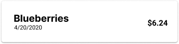

# Requirements Document

## Main Screen
1. The webpage is responsive and all transaction entry components will fit within the iPhone X standard size mobile screen (375x812px).
2. The app will be divided into three sections: budget summary depicting ‘daily budget’ and the ‘rollover’  from the user’s inputted transactions, an ‘entry form’, and a list of latest transactions. Each component is defined below.

## Budget Summary (Figure 1)
3. The budget summary area will appear at the top of the screen.
4. The ‘expenses to date’ value is initialized with zero.  Each time the user completes the  ‘entry form’ the amount spent (defined in requirement 6) from the form will be added to the ‘expenses to date’ value. 
5. The user will be able to edit the value in the daily budget field, limited to positive and non-zero numbers. The program will save the user's field entry as ‘daily budget’.
6. The ‘budget to date’ value is initialized with the ‘daily budget’ value. At the start of each calendar day (determined by the timezone on the users’ local device) the program will add the ‘daily budget’ value to the ‘budget to date’.
7. That ‘running total’ will be subtracted from the ‘budget to date’. The program will display this value to the user and label it as ‘rollover’ (the amount of money left over from the budget of the previous days). 

## Entry Transaction Form (Figure 1)
8. The ‘entry form’ has two required text fields (labeled amount spent and item name), and an optional date field (labeled date). The text field labeled amount spent will be limited to positive, non-zero numbers.
9. The default value for the date field will be the current date (determined by the timestamp on the users’ local device). Even though the user does not include time, the program collects both date and time. 

## Latest Transaction (Figure 2)
10. Below the entry form, the program will display a list of transactions the user has entered, sorted from the most recent date and time (descending order) of the entered transactions. 
11. The latest transaction section will be scrollable to allow users to view all of the transactions the user has entered.

## Flex Requirement: Login Page (Figure 3)
12. The login page will consist of “Login” and “Sign Up” buttons that will deliver the user to the Firebase Google Cloud login or sign up page.
13. The program will use the ‘User ID’ value generated by Firebase for each user as the parent object in which the specific user’s program data is stored (Max will add a picture of a schema)

