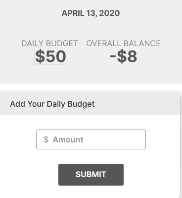

# Requirements Document

## Main Screen
1. The webpage is responsive and all transaction entry components will fit within the iPhone X standard size mobile screen (375x812px).
2. The app will be divided into three sections: budget summary depicting ‘daily budget’ and the ‘overall balance’  from the user’s inputted transactions, an ‘entry form’, and a list of latest transactions. Each component is defined below.
3. A new user will see the three sections with a default  value of 0 for ‘daily budget’ and ‘overall balance’. The new user will see a ‘add your daily budget’ form to submit a first daily budget. This form only appears for new users.
4. A returning user will see the three sections: Budget Summary, Add Your Daily Budget, and Enter Transaction. Once the user has submitted their first Daily Budget, they will be considered a Returning User. From then on, if the user would like to change their daily budget, they will have to click on their Daily Budget Amount in the Budget Summary, which will be a text box they can edit the amount in.
5. The login page is not a part of our MVP requirement. Historical transaction data are stored in state (locally) for the ‘Latest Transaction’ section.

**Figure 1: Budget Summary & Entry Transaction Form**

## Budget Summary (Figure 1)
6. The budget summary area will appear at the top of the screen.
7. The ‘expenses to date’ value is initialized with zero.  Each time the user completes the  ‘entry form’ the amount spent from the form will be added to the ‘expenses to date’ value. 
8. The user will be able to edit the value in the daily budget field, limited to positive and non-zero numbers. The program will save the user's field entry as ‘daily budget’.
9. The ‘budget to date’ value is initialized with the ‘daily budget’ value. At the start of each calendar day (determined by the timezone on the users’ local device) the program will add the ‘daily budget’ value to the ‘budget to date’. 
10. That ‘running total’ will be subtracted from the ‘budget to date’. The program will display this value to the user and label it as ‘overall balance’ (the amount of money leftover from the budget of the previous days). 

## Entry Transaction Form (Figure 1)
11. The ‘entry form’ has two required text fields (labeled ‘amount spent’ and ‘item name’), and an optional date field (labeled date). 
12. The text field labeled ‘amount spent’ will be limited to positive, non-zero numbers.
13. The program will use a react date picker component to ensure the user inputs valid dates. The program will then store the input using the Date object native to javascript. 
14. The default value for the date field will be the current date (determined by the timestamp on the users’ local device).  

**Figure 2: Latest Transaction Card**

## Latest Transaction (Figure 2)
15. Below the entry form, the program will display a list of transactions the user has entered, sorted from the most recent date and time (descending order) of the entered transactions. 
16. The latest transaction section will be scrollable to allow users to view all of the transactions the user has entered. 
17. When displaying transactions to the user, the program will format ‘amount spent’ with a dollar sign and then dollar amount rounded to the nearest hundredth of a dollar(eg '$6.24').  
18. When displaying transactions to the user, the program will format the date value with the number value of the month(eg 1-12), followed by day of the month, followed by the full year, all separated by backslashes(eg '4/20/2020').

**Figure 3: Login Page**

## Flex Requirement: Login Page (Figure 3)
1. A new user will see a sign-up screen and be prompted to register an email and password. They will be led into the main screen upon completion.
2. A returning user will immediately be taken to the main screen upon authentication.
3. The login page will consist of “Login” and “Sign Up” buttons. Upon clicking either button, the user will be routed through Firebase User Authentication systems that Firebase has pre-built.  The user will only be prompted with two methods of authentication; through a Gmail address and a generic email address(which further prompts a name and password). Both authentication methods are pre-constructed by firebase. Our program will only verify that a user has been authenticated or not.
The program will use the ‘User ID’ value generated by Firebase for each user as the parent object in which the specific user’s program data is stored. Example picture below:

**DB Example**

